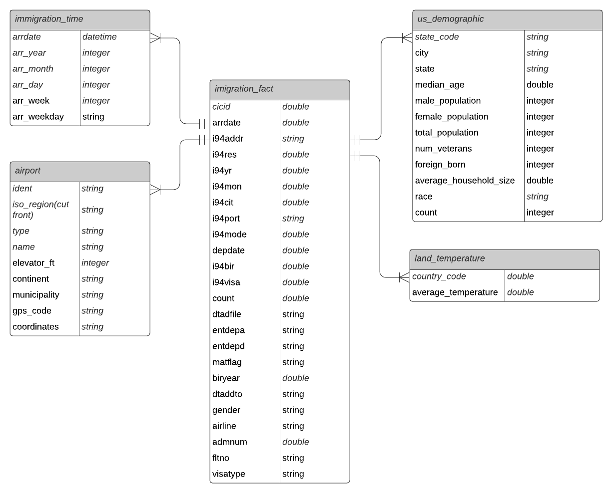

[![LinkedIn][linkedin-shield]][linkedin-url]

<!-- PROJECT LOGO -->
 

  <h3 align="center">US Immigration Data Pipeline</h3>

  

    Create ETL Data Pipeline using Spark.
     
     
    <a href="https://github.com/BankNatchapol/US-Immigration-Data-Pipeline/issues">Report Bug</a>
    ·
    <a href="https://github.com/BankNatchapol/US-Immigration-Data-Pipeline/issues">Request Feature</a>
  

<!-- ABOUT THE PROJECT -->
## About The Project

This project is to create ETL Data pipeline using spark for 4 datasets immigration, airport, us demographics and world temperature data.

There are 5 detailed steps:
* Step 1: Scope the Project and Gather Data
* Step 2: Explore and Assess the Data
* Step 3: Define the Data Model
* Step 4: Run ETL to Model the Data
* Step 5: Complete Project Write Up

## Step 1: Scope the Project and Gather Data

### Scope 
- use spark to load data to workspace.
- EDA for checking missing value.
- cleaning data based on EDA result.
- using spark to write parquet file

## Describe and Gather Data 
### I94 Immigration Data
This data comes from the US National Tourism and Trade Office. 
Each report contains international visitor arrival statistics by world regions and select countries (including top 20), type of visa, mode of transportation, age groups, states visited (first intended address only), and the top ports of entry (for select countries).
The immigration data in a folder with the following path: ../../data/18-83510-I94-Data-2016/. There's a file for each month of the year. An example file name is i94_apr16_sub.sas7bdat. Each file has a three-letter abbreviation for the month name. So a full file path for June would look like this: ../../data/18-83510-I94-Data-2016/i94_jun16_sub.sas7bdat. 

### World Temperature Data
The World Temperature dataset comes from Kaggle and represents global land temperatures by city.

### U.S. City Demographic Data
This data comes from OpenSoft and contains information about the demographics of all US cities and census-designated places with a population greater or equal to 65,000. Original data comes from the US Census Bureau's 2015 American Community Survey.

### Airport Code Table
This is a simple table of airport codes and corresponding cities.

## Step 2: Explore and Assess the Data
### Exploratory Data Analysis and Cleaning Data contain this visualization steps

#### Visualize World Temperature Data missing values

#### Visualize I94 Immigration Data missing values

#### Visualize U.S. City Demographic Data missing values

#### Visualize Airport Code Table missing values

### Step 3: Define the Data Model
#### 3.1 Conceptual Data Model

#### 3.2 Mapping Out Data Pipelines
pipeline steps 
- load the datasets
- cleaning data, missing values
- transform raw data to our data models

### Step 4: Run Pipelines to Model the Data 
#### immigration fact table
#### immigration time table
#### airport table
#### us demograghic table
#### land temperature table

<!-- CONTACT -->
## Contact

Facebook - [@Natchapol Patamawisut](https://www.facebook.com/natchapol.patamawisut/)

Project Link: [https://github.com/BankNatchapol/US-Immigration-Data-Pipeline](https://github.com/BankNatchapol/AWS-Data-Warehouse-ETL)

<!-- MARKDOWN LINKS & IMAGES -->
<!-- https://www.markdownguide.org/basic-syntax/#reference-style-links -->
[linkedin-shield]: https://img.shields.io/badge/-LinkedIn-black.svg?style=for-the-badge&logo=linkedin&colorB=555
[linkedin-url]: https://www.linkedin.com/in/natchapol-patamawisut
